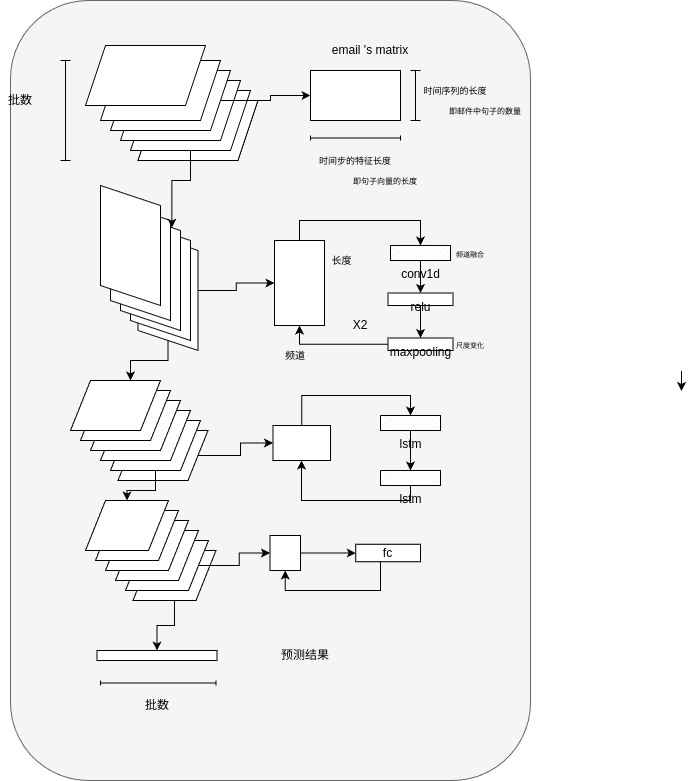
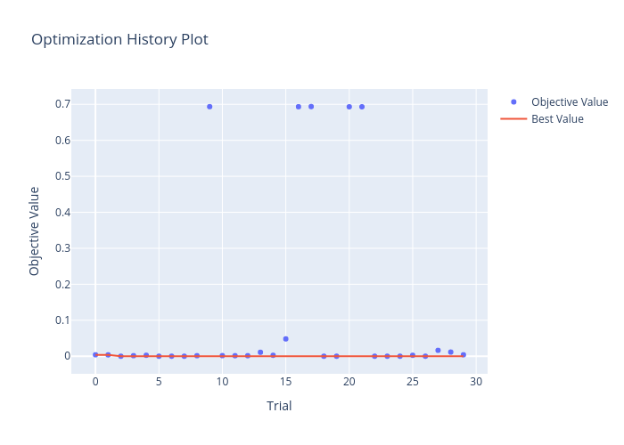
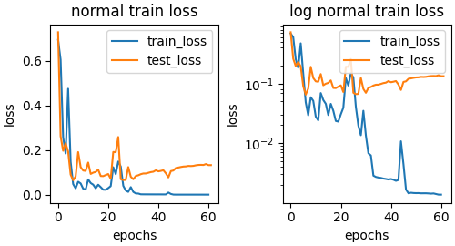
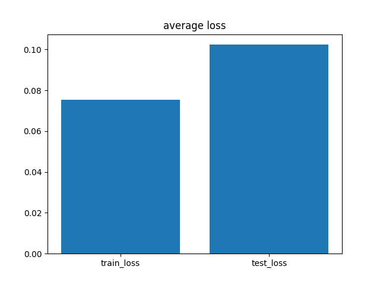
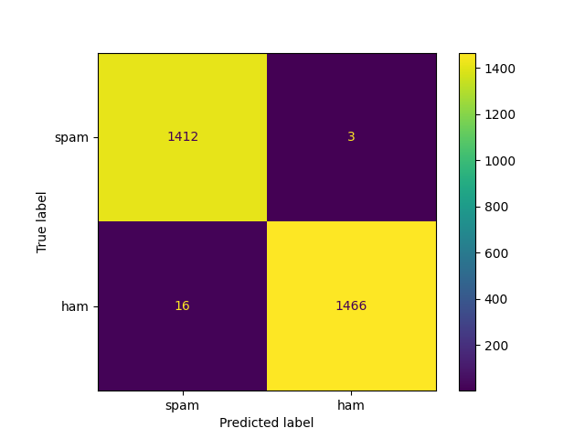
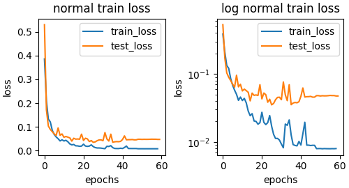
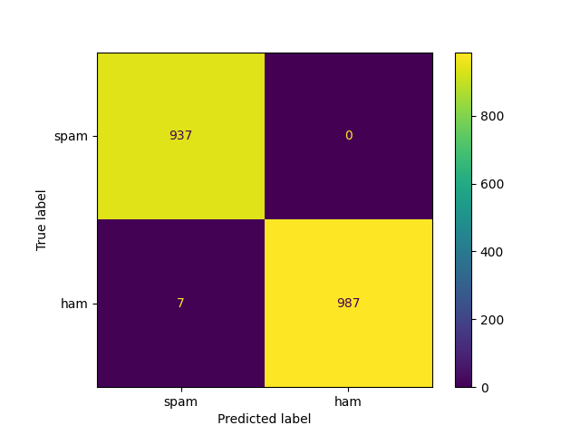

# 工作流程
## 模型结构

## 超参数的搜索
### optuna：贝叶斯搜索
### result
位置：./figures/hyperPara.png

其中的一个损失函数：

## k-fold 验证
### result

#### 搜索损失变化

  
  

#### 平均损失

#### 平均混淆矩阵

## 训练结果
### result
##### 统计数据
```  
              precision    recall  f1-score   support

           0       0.99      1.00      1.00       937
           1       1.00      0.99      1.00       994

    accuracy                           1.00      1931
   macro avg       1.00      1.00      1.00      1931
weighted avg       1.00      1.00      1.00      1931

```
##### 损失曲线:

##### 混淆矩阵：
